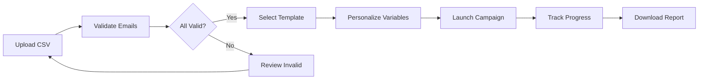
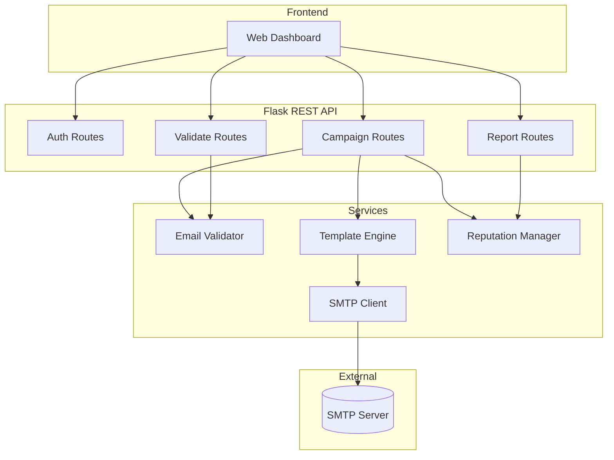
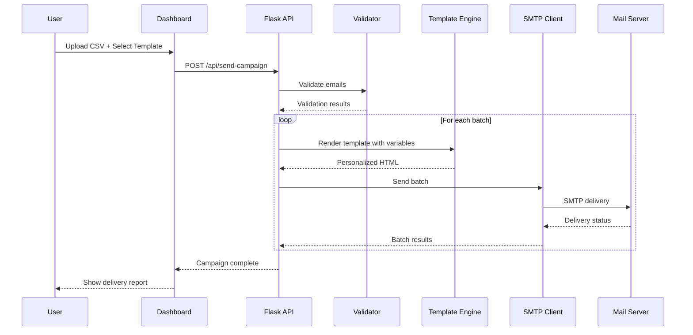

<div align="center">

# Mass Mailer

### Bulk Email Campaigns Made Simple

*Upload CSV → Pick Template → Hit Send → Track Results*

[](https://python.org)
[](https://flask.palletsprojects.com)
[](https://developer.mozilla.org/en-US/docs/Web/JavaScript)
[](LICENSE)


</div>

## The Problem

Sending personalized emails at scale is **painful**:
- Enterprise tools cost a fortune
- Open-source alternatives are overly complex  
- No proper validation = bounced emails = ruined reputation
- Tracking delivery? Good luck.

## Our Solution

A **self-hosted**, **full-stack** email campaign platform that just works.

## How It Works



## Features

<table>
<tr>
<td width="50%">

### Smart CSV Import
- Drag & drop recipient lists
- Auto-validates email format
- MX record verification
- Handles thousands of emails

</td>
<td width="50%">

### Template Engine
- Pre-built professional templates
- Custom HTML support
- Variable substitution: `{{name}}`, `{{email}}`
- Live preview before sending

</td>
</tr>
<tr>
<td width="50%">

### Real-time Tracking
- Watch campaign progress live
- Detailed delivery reports
- Export results to CSV
- Per-recipient status

</td>
<td width="50%">

### Reputation Management
- Bounce tracking
- Automatic suppression lists
- Rate limiting built-in
- Configurable batch delays

</td>
</tr>
</table>

## Tech Stack

<div align="center">

| Layer | Technologies |
|:-----:|:-------------|
| **Backend** |   |
| **Frontend** |    |
| **Testing** |   |

</div>

## Quick Start

```bash
# 1. Clone
git clone <repo-url> && cd mass-mailer

# 2. Install
cd backend && pip install -r requirements.txt && cd ..

# 3. Configure
cp .env.example .env
# Edit .env with your SMTP credentials

# 4. Launch
cd backend && python app.py
```

<div align="center">

**Open** `http://localhost:5000` **→ Login → Start Sending!**

</div>

## Configuration

```env
# .env
SMTP_HOST=smtp.gmail.com
SMTP_PORT=587
SMTP_USERNAME=your-email@gmail.com
SMTP_PASSWORD=your-app-password
ADMIN_ACCESS_TOKEN=your-secret-token
```

## Architecture



## Email Sending Flow



## Project Structure

```
mass-mailer/
├── backend/
│   ├── app/
│   │   ├── routes/        # API endpoints
│   │   └── services/      # SMTP, validation, templates
│   └── tests/             # pytest suite
├── frontend/
│   ├── dashboard.html     # Main UI
│   ├── login.html         # Auth page
│   └── js/                # Frontend logic
├── config/                # YAML configurations
└── test-data/             # Sample CSVs
```

## API Reference

| Endpoint | Method | Description |
|:---------|:------:|:------------|
| `/api/health` | `GET` | Health check |
| `/api/validate-emails` | `POST` | Validate email list |
| `/api/configure-smtp` | `POST` | Update SMTP settings |
| `/api/send-campaign` | `POST` | Launch campaign |
| `/api/campaign-status/:id` | `GET` | Track progress |
| `/api/delivery-report/:id` | `GET` | Get detailed report |

## Roadmap

- [ ] Scheduled campaigns
- [ ] A/B testing for templates
- [ ] Open/click tracking analytics
- [ ] Webhook integrations
- [ ] Multi-user with role-based access

## Testing

```bash
# Backend
cd backend && pytest

# Frontend
cd frontend && npm test
```

---

<div align="center">

### Built at the Hackathon

**Star this repo if you found it useful!**

</div>
